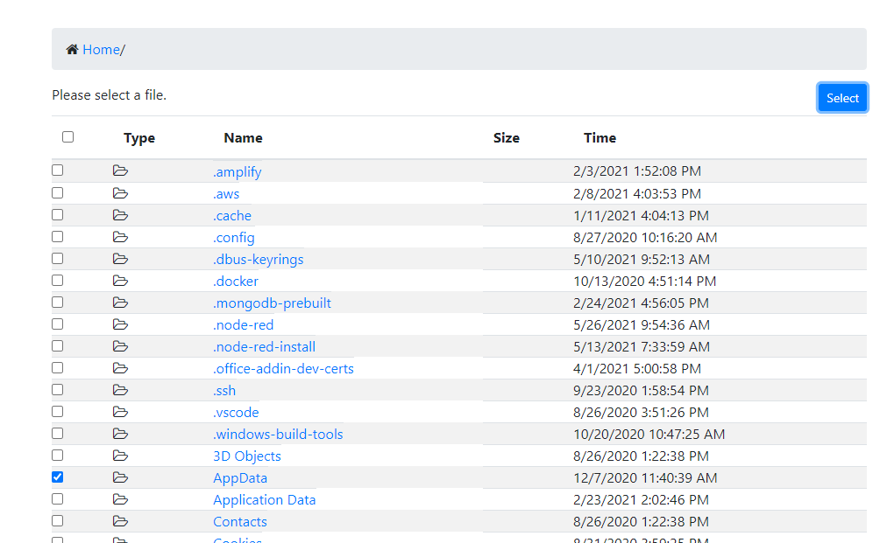

# NgxFileSelect

This is a local file browse web component that you can integrate into your website.  


This project was generated with [Angular CLI](https://github.com/angular/angular-cli) version 10.1.1.

## Usage

The file-browse custom component is exported from this library.  The goal of this component is to select files from your local filesystem, and return the result to anyone who is listening.  Anywhere in your code, you can add the following text to listen:

```javascript
      window.addEventListener('fselect', (event) => { 
        alert('File selected: ' + JSON.stringify(event.detail))
      })
```
And add the following tag to display the browse component.  The browser will resize to the parent container courtesy of Bootstrap responsive magic:

```html
      <file-browse></file-browse>
```

To integrate the file-browse component into your own app, import ngx-file-select.js, and styles.css into your web app.  Additionally, you will need to reference the copy of Bootstrap 4.  

```html
  <link href="styles.css" rel="stylesheet">
  <link href="https://maxcdn.bootstrapcdn.com/bootstrap/4.0.0/css/bootstrap.min.css" rel="stylesheet">
  <script src="ngx-file-select.js"></script>
```

### Parameters

* filter - What files you want to display in the search dialog.  (Folders can not be hidden)

```html
      <file-browse filter="gif|png"></file-browse>
```


## Development server
If you want to run this locally, first run:
```bash
      npm install
      npm run build
```

Once built, you can run `ng serve` for a local dev server. Navigate to `http://localhost:4200/`. The app will automatically reload if you change any of the source files.

## Code scaffolding

Run `ng generate component component-name` to generate a new component. You can also use `ng generate directive|pipe|service|class|guard|interface|enum|module`.

## Build

Run `ng build` to build the project. The build artifacts will be stored in the `dist/` directory. Use the `--prod` flag for a production build.

## Running unit tests

Run `ng test` to execute the unit tests via [Karma](https://karma-runner.github.io).

## Running end-to-end tests

Run `ng e2e` to execute the end-to-end tests via [Protractor](http://www.protractortest.org/).

## Further help

To get more help on the Angular CLI use `ng help` or go check out the [Angular CLI README](https://github.com/angular/angular-cli/blob/master/README.md).

